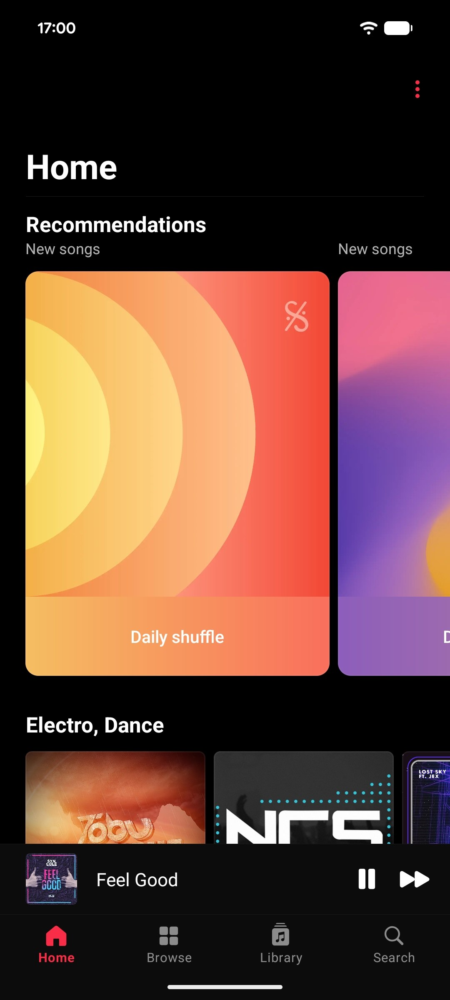
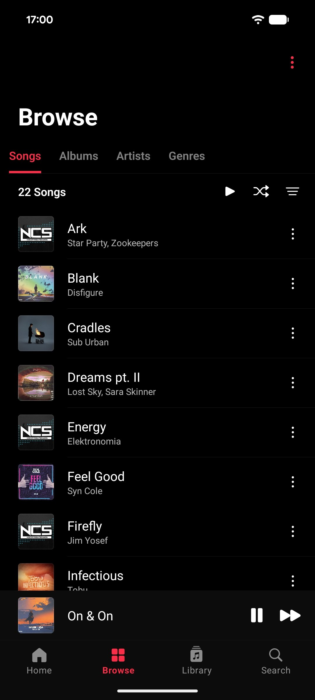
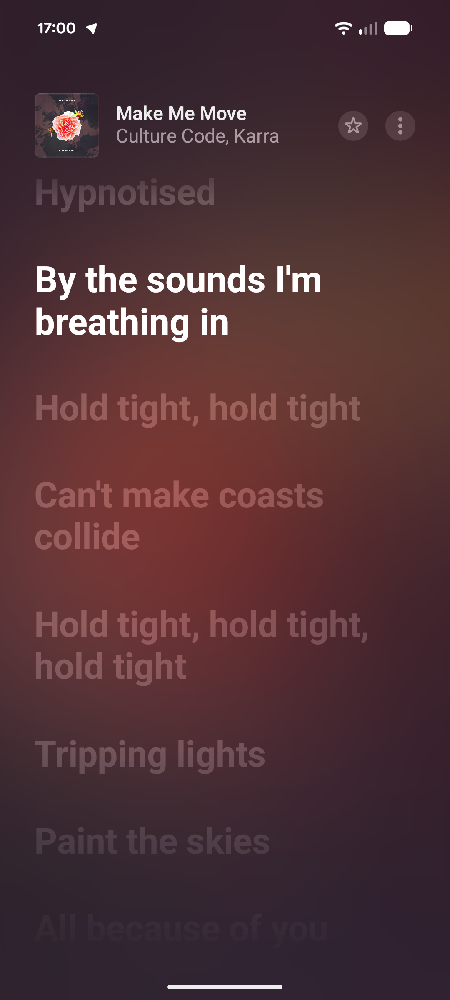

# Accord

A fork of [Gramophone](https://github.com/AkaneTan/Gramophone) / [AccordLegacy](https://github.com/FoedusProgramme/AccordLegacy) with bug fixes, updated dependencies, and new features.

## Screenshots

<p>
  
  
  
</p>
<p>
  
  
  
</p>

## Installation

Download the latest APK from [GitHub Releases](https://github.com/emylfy/Accord/releases/latest).

## Building

```bash
git clone https://github.com/emylfy/Accord.git
cd Accord
./gradlew assembleRelease
```

APK will be in `app/build/outputs/apk/release/`.

## Credits

Based on [Gramophone](https://github.com/AkaneTan/Gramophone) by AkaneTan and [AccordLegacy](https://github.com/FoedusProgramme/AccordLegacy) by FoedusProgramme.

Original developers: [@AkaneTan](https://github.com/AkaneTan), [@lightsummer233](https://github.com/lightsummer233), [@123Duo3](https://github.com/123Duo3)

Fork maintained by [@emylfy](https://github.com/emylfy)

## License

GPL-3.0 — see [LICENSE](LICENSE) for details.
